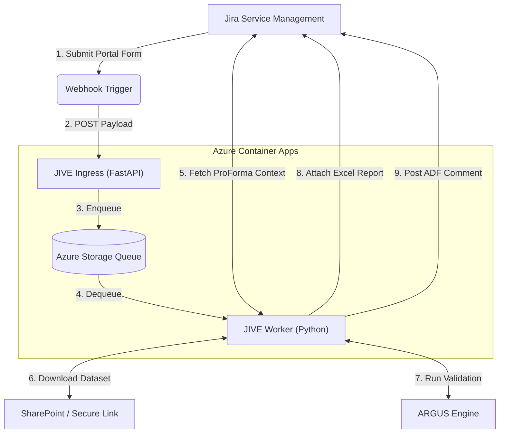

# JIVE — Jira IMPACT Validation Engine

**JIVE** (Jira IMPACT Validation Engine) is an asynchronous, event-driven microservice that automates Research Quality Assurance (RQA) workflows. It bridges the Jira Service Management (JSM) portal with the [Argus](https://github.com/impact-initiatives/argus) engine to automatically download submitted datasets, execute validation pipelines, generate Excel reports, and post structured Atlassian Document Format (ADF) comments back to Jira tickets.

## Overview

Research data collected through household surveys, market assessments, and key informant interviews undergoes rigorous quality assurance before publication. Historically, this involved manual scripts, downloading files, interpreting output, and back-and-forth communication on Teams or email.

JIVE automates this bottleneck. When a country team member submits a dataset for review via a Jira ticket, JIVE automatically:
1. Receives the webhook event from Jira.
2. Extracts dataset context (dataset type, secure links) from Jira ProForma forms.
3. Downloads the dataset securely.
4. Executes the full `ARGUS` pipeline.
5. Generates a multi-sheet Excel report detailing all errors, warnings, and info messages.
6. Posts a formatted summary comment directly on the Jira ticket and attaches the Excel report.

### The Asynchronous Queue Architecture

Data validation is computationally expensive. Datasets can contain hundreds of thousands of rows across multiple sheets, requiring cross-referencing against cleaning logs and complex schema definitions. If this ran synchronously inside a Jira webhook handler (which requires a response within seconds), the HTTP connection would time out and fail.

JIVE solves this by **decoupling ingestion from processing** using Azure Storage Queues and Azure Container Apps:
- **Ingress**: A lightweight FastAPI gateway immediately returns `HTTP 202 Accepted` to Jira and pushes the payload to the queue.
- **Worker**: A background python worker asynchronously pulls jobs from the queue. Leveraging **KEDA** (Kubernetes Event-driven Autoscaling), the worker container scales down to 0 when idle (costing nothing) and scales out dynamically based on the queue length.

---

## Architecture



---

## Project Structure

```text
jive/
├── main.py                  FastAPI ingress (webhook endpoint)
├── worker.py                Queue consumer (orchestrates validation lifecycle)
├── worker_utils.py          ProForma parsing, secure link resolution, and pipeline execution
├── jira_client.py           Jira / JSM REST API client (with Tenacity retries & rate-limit handling)
├── models.py                Pydantic models for inbound Jira webhook payloads
├── report_formatter.py      Transforms PipelineResponse into Atlassian Document Format (ADF)
├── excel_exporter.py        Generates multi-sheet Excel validation reports using Polars
├── logger.py                JSON-structured logging for Azure Log Analytics
├── Dockerfile               Multi-stage optimized build image
├── pyproject.toml           Project dependencies (managed via uv)
├── local/                   Local exploration and Docker Compose setup
├── tests/                   Standard Pytest automated test suite
└── infra/                   Bicep IaC templates for Azure deployment
```

---

## Local Development & Configuration

### Prerequisites
* Python 3.12+
* [uv](https://docs.astral.sh/uv/) package manager
* [Azurite](https://learn.microsoft.com/en-us/azure/storage/common/storage-use-azurite) (Local Azure Storage Emulator)

### Environment Variables
Create a `.env` file in the project root:

| Variable | Required | Description |
|---|---|---|
| `AZURE_STORAGE_CONNECTION_STRING` | Yes | Azure Storage / Azurite connection string |
| `JIVE_API_KEY` | Yes | Webhook authorization token  |
| `JIRA_API_EMAIL` | Yes | Service Account API Email |
| `JIRA_API_TOKEN` | Yes | Service Account API Basic Token |
| `JIVE_QUEUE_NAME` | No | Target Queue name  |
| `JIRA_BASE_URL` | No | Jira Cloud URL  |
| `JIVE_MAX_ATTACHMENT_MB` | No | Prevents out-of-memory errors on massive downloads (default: `250`) |

## [JIVE-ARGUS Demo](https://app.notion.com/p/JIVE-Demo-372e735be74b80cdb994ff0a9d0fbab4)

### Running the Services Locally

We recommend using the provided `docker-compose.yml` to perfectly mirror the Azure architecture (FastAPI Gateway + Azurite + Worker):

```bash
# Build and run the entire stack locally
docker compose -f local/docker-compose.yml up --build
```
* **JIVE Ingress Gateway**: Accessible at `http://localhost:8000/api/webhook`
* **Azurite Emulator**: Emulates Azure Storage Queues at `http://localhost:10001`
* **Background Worker**: Polls Azurite for jobs, executes validation, and interacts with Jira.

Alternatively, you can run them via `uv`:
```bash
uv run uvicorn main:app --host 127.0.0.1 --port 8000 --reload
uv run python worker.py
```

To connect Jira automation components to a locally hosted envrionment an additional service is required to allow Jira to connect to a localhost address. Services like [ngrok](ngrok.com/) can be used for this. 

### Running Tests
The project features a comprehensive `pytest` suite testing webhooks, workers, ProForma parsing, and Excel generation.
```bash
uv run pytest tests/ -v
uv run ruff check .
```

---

## Azure Cloud Deployment

The entire infrastructure is defined as Code (IaC) using Azure Bicep located in the `infra/` directory.

### Key Infrastructure Features:
* **Azure Container Apps (ACA)**: Serverless hosting for the Ingress and Worker apps.
* **KEDA Scaling**: The Worker app automatically scales based on the length of the Azure Storage Queue.
* **Security**: System-Assigned Managed Identities are used to pull secrets (Jira API keys, connection strings) directly from **Azure Key Vault**. Secrets are never exposed in environment variables.
* **Observability**: An **Azure Log Analytics** workspace is automatically provisioned and linked to the Container App environment for centralized JSON-structured logging.

### Deployment Commands
```bash
# 1. Deploy all infrastructure (Storage, KeyVault, Container Apps, Log Analytics)
az deployment group create \
  --resource-group rg-impact-etl \
  --template-file infra/main.bicep \
  --parameters infra/parameters/prod.bicepparam

# 2. Build and Push Docker Image to Azure Container Registry
az acr build --registry <your-acr-name> --image jive:latest .

# 3. Update Container Apps to use the latest image
az containerapp update --name jive-ingress --resource-group rg-impact-etl --image <your-acr-name>.azurecr.io/jive:latest
az containerapp update --name jive-worker --resource-group rg-impact-etl --image <your-acr-name>.azurecr.io/jive:latest
```
*(Note: Automated CI/CD via GitHub Actions is planned for the near future).*

---

## Roadmap

- [ ] Upload validation reports to Azure Blob Storage and include a SAS download link in the Jira comment instead of attaching the file directly (avoids Jira attachment size limits)
- [ ] Transition the Jira ticket to a target status automatically based on validation results (e.g., move to "Approved" on pass (default: JIRA_TRANSITION_APPROVED), "Needs Revision" on fail (default: JIRA_TRANSITION_REVISION))
- [ ] Add support for multiple dataset types beyond JMMI (MSNA, ESNFI) with automatic schema detection
- [ ] Implement Azure Managed Identity for Key Vault secret retrieval at runtime, removing the need for connection strings in environment variables

---

## Related Repositories
- [`impact-initiatives/argus`](https://github.com/impact-initiatives/argus) — A flexible framework for validating standardised and less-standardised datasets.
- [`impact-initiatives/argus_schemas`](https://github.com/impact-initiatives/argus_schemas) — Configuration files for Argus datasets.
